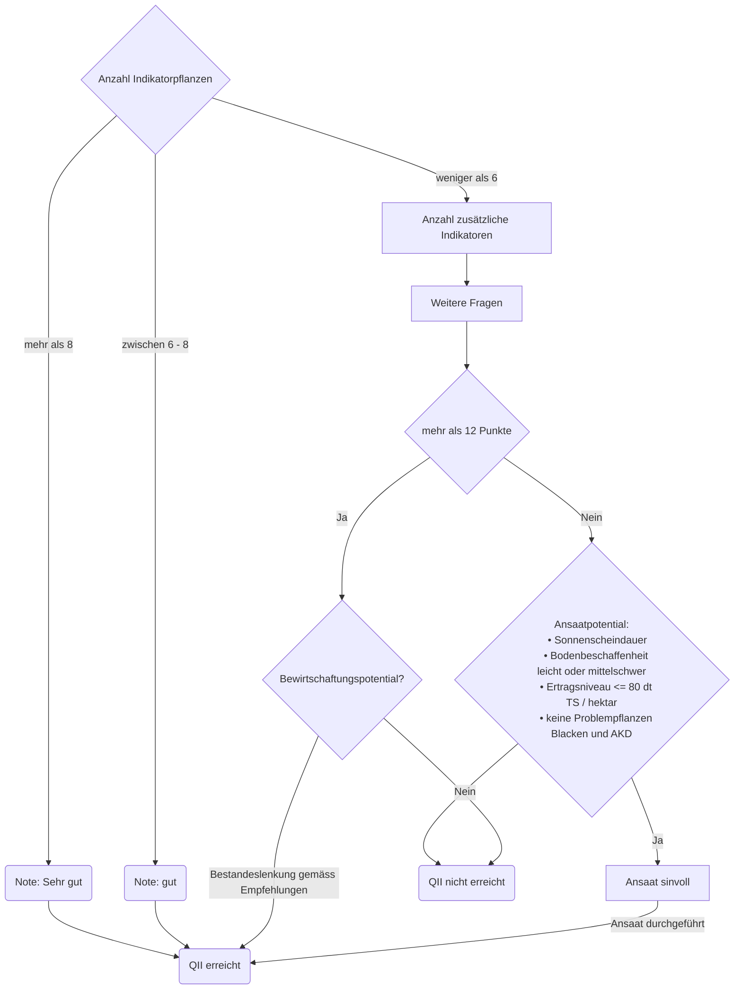

Open Farming Hackdays 2026
==========================

## Challenge

**Rewild the meadow**

## User story

**Als** Martina, 28, Landwirtin EFZ
**möchte ich** eine neu gepachtete Fläche mit gezielten Massnahmen so vorbereiten,
**so dass** sich die Flächen für QII + Vernetzungsbeiträge qualifizieren.

## Spezifikationen

- Keine Beratung durch Personen, da Martina die kantonale Beratung schon gebraucht hat.
- Vorgeschlagene Massnahmen müssen
    - aktuell (basierend auf Gesetzesgrundlagen),
    - standortspezifisch,
    - wirksam und
    - kosteneffizient (gratis) sein.
- Vorgeschlagene Massnahmen müssen intuitiv erklärt sein.

## Martinas Problem

Ich habe

- keine Zeit,
- (gratis) Beratungslimite aufgebraucht,
- konservative Eltern,
- limitierte finanzielle Mittel,
- Versteht die Sprache der Auflagen in der DZV nicht,
- Lese nicht gerne die vielen, veralteten Merkblätter, die überall rumschwirren,
- fehlende Erfahrung bei der Bewirtschaftung von BFF-QII-Flächen,
- Angst, meine Beiträge zu verlieren, wenn sie Fehler in der Bewirtschaftung verliert.

## Flowchart



## Render instructions file

The instructions file is composed from multiple markdown files and can be rendered with Quarto, using:

``` bash
quarto render docs/INSTRUCTIONS.qmd
```
